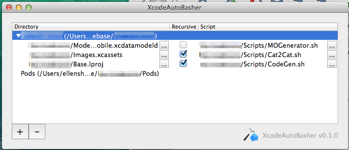

XcodeScriptWriter
=================

#What

An Xcode plugin to run a given script any time a given folder or its children have changes. 

#Why

I use several small convenience utilities that are run via shell script. I've previously been running these manually by creating build targets for each of them, but realized I could tie each of them to changes in a specific folder. 

My idea was to create something that could do all of the following: 

- Watch the `.xcassets` folder recursively and run a script that fires off [Cat2Cat](http://github.com/vokalinteractive/Cat2Cat) whenever an `imageset` is added, removed, or renamed. 
- Watch the folder where all my Storyboards live and run a script that fires off [objc-identifierconstants](https://github.com/square/objc-codegenutils) when one of my storyboards is changed. 
- Watch my `.xcdatamodeld` and fire off [MOGenerator](https://github.com/rentzsch/mogenerator) anytime a change to the data model is saved. 

The product of that thought process is `XcodeScriptWriter`. 

#Where
Eventually: [Alcatraz](http://alcatraz.io). 

Until then (or if you hate convenience): 

1. Check out or download a .zip of the code. 
2. Build and run. 
3. Restart Xcode. 

#How

After installing, once you restart Xcode, there will be a new option under the `Window` menu for `XcodeScriptWriter`. Open that up, and you will see a window that allows you to add folders. 

1. Click the plus button to add a row. 
2. Click in the area of the first column to bring up a file selection dialog where you can pick what file or folder you wish to observe.
3. Check the checkbox if you want to watch this folder recursively (ie, if you want to watch all of its children as well).
4. Click in the area of the third column to bring up a file selection dialog where you can pick the script you want to run when a change is detected. 

**Note**: You should verify your script runs via the Terminal *before* you try to add it to `XcodeScriptWriter`—this will significantly narrow down your "Is this plugin screwing up or is it me?" troubleshooting time.  Scripts should be executable on their own—that is, they should have the executable bit set (`chomod +x ...`) and the first line should be something like `#!/bin/bash` or `#!/usr/bin/env python` (a "[shebang](http://en.wikipedia.org/wiki/Shebang_(Unix))").

#When
RIGHT NOW!!!

#Who
Initially a [VOKAL](http://www.vokalinteractive.com) Hack Days Fall 2014 Project by [Ellen Shapiro](http://github.com/designatednerd). Open source contributions are encouraged!

#//TODO: 
- Get plugin up on Alcatraz
- ??? File an issue or put up a pull request!